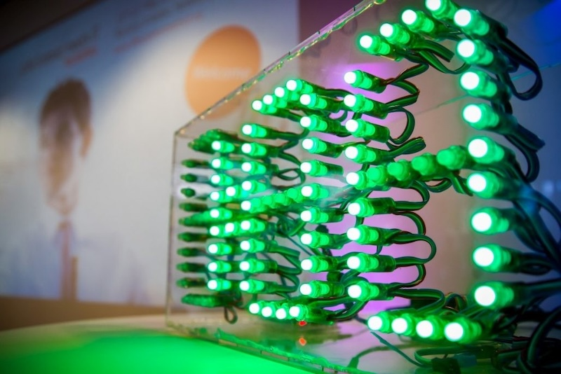

# Heidelberg Pitch Clock
A pitch clock for startup events, hackathons, etc.

## History

Our pitch clock story started back in May 2017, during our second {Life Science} meet IT | Hackathon. We were prepping for the event and looking at what worked and what didn't from the first round. A big issue? Timing the final presentations.

Last time, we used a second projector for the countdown. It was a hassle to set up, distracting, and just plain ugly. We needed a digital clock that was big enough for everyone to see, but not so big it overshadowed the presenters. Simple, right? Not quite.

We searched high and low. Sports clocks were way too expensive. Workshop timers were too small. And nothing out there felt right for a hackathon.

With just a few days before the event, I decided to build our own clock. It needed to be noticeable for our 100+ audience, flexible for our timing needs, and a bit nerdy for that hackathon vibe. The concept was inspired by the [Flaschen Taschen](https://www.noisebridge.net/wiki/Flaschen_Taschen) project I had seen at the Noisebridge hackerspace in San Francisco. 

What started as a last-minute fix turned into something bigger. We’ve used that clock at countless events and accelerator programs. It’s become a bit of a star, even getting borrowed by friends and partners in the innovation scene. People loved it so much they've asked how we made it.

So there you have it. Our hackathon pitch clock was born out of necessity, but it’s now an essential tool we couldn’t do without. And we're happy to share how we did it.

## Ingredients

Here's what we used for the original version of our pitch clock:

First up, 92 individually addressable RGB LEDs (WS2801). For the frame, we used sheets of transparent acrylic glass, each 3 mm thick. The heart of the clock is powered by an Arduino Uno microcontroller board. For displaying the timer, we used a 16x2 LCD with an I2C/SPI backpack.

Control was essential, so we included three buttons—22 mm arcade-style closers, which gave it a cool, retro vibe. To fine-tune settings, we added a potentiometer, anything in the kilo-ohms range works fine. For power, we went with a solid 5v power source. Each LED can draw up to 60 mA, leading to a theoretical max of 5.52 amps, though we rarely hit full usage with all colors blazing.

Finally, adequate cabling, fuses, and other essentials rounded out our setup. That was the original build of our pitch clock—innovative, functional, and a bit nerdy, just like a hackathon should be.

## Time for a new version

The Arduino version has served us well for years. We've used it almost every evening some weeks. But there's one drawback: all the controls are on the clock itself. This means we have to walk over and press buttons each time. For the next version, we're aiming to make it operable from a distance. An obvious solution: Wi-Fi. This way, it can be controlled right from a PC at the sound engineering desk or even from a mobile phone.

But technically, there's a catch: microcontrollers with Wi-Fi use 3.3 volts, while the LEDs need 5 volts. So, we'll need an extra component—a level shifter. And since we're upgrading, we'll also modernize the display and replace the potentiometer with two more buttons.

## Custom PCB to the rescue

The level shifter was necessary, which made mounting and cabling all the components individually impractical. The solution was a custom-printed circuit board (PCB), which unified the microcontroller, display and level shifter.

## The latest bill of materials

* 92 individually addressable RGB LEDs with 12mm diameter (WS2801)
* 3mm transparent acrylic sheets
* Raspberry Pi Pico WH
* 1.3 inch OLED I2C 128 x 64 pixel display
* 5 22mm arcade style push buttons
* A level shifter
* A diode
* Some screw terminal

